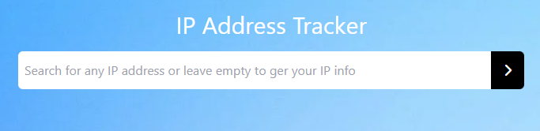
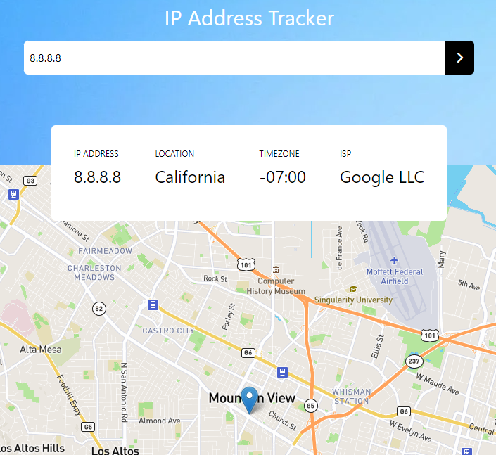

# Project Concept
```
A simple IP tracking project that uses the leaflet library for mapping 
and ipify API for IP tracking purposes!
```

## Project setup

```
First, you need to install all dependencies. Type **npm install** in your terminal!
It'll install everything it needs. If you want to know the dependencies, check the package.json!

After the installation is complete, you need to type **npm run serve** to start the server in your localhost, usually :8080. 
After that, you're free to go!
```
<p align="center">
    
</p>

```
You'll first see the Home page in which you'll enter the IP you want to track!
You can also leave it empty so the API will track your IP instead.
```

<p align="center">
  
</p>


```
It's a simple and easy project since the documentation of both the libraby and API are easy to read an grasp.
You're free to clone this repository and tweak all you want!
```